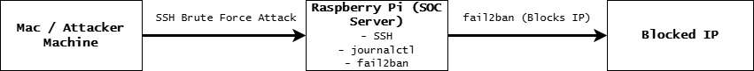
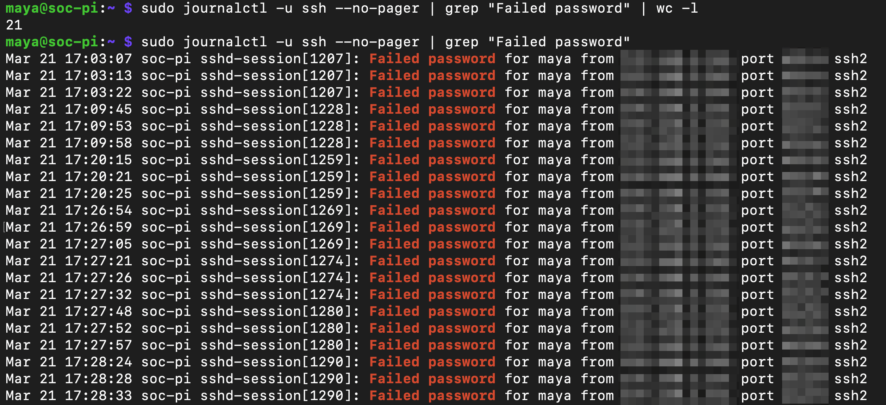
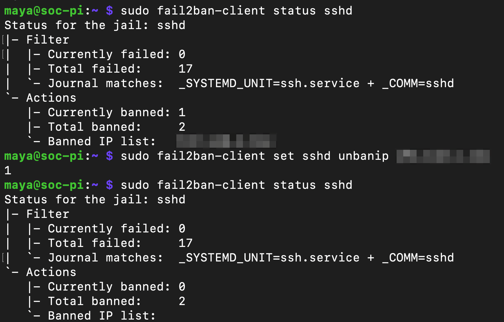

# Raspberry Pi SOC Lab
## 🏗️ Architecture

## Overview
I built this project to get hands-on experience with how a Security Operations Center (SOC) actually works.

Instead of just learning concepts, I wanted to simulate a real-world scenario where I can detect and respond to SSH brute force attacks on a Linux system. This lab runs on a Raspberry Pi 5 and focuses on log analysis, attack detection, and automated defense.

---

## What I Built
- A lightweight SOC-style environment using a Raspberry Pi
- SSH-based remote system management
- Log monitoring using `journalctl`
- Detection of repeated failed login attempts
- Automated IP blocking using `fail2ban`

---

## Lab Setup
- **Raspberry Pi 5 (8GB)** — main system
- **Mac** — used to simulate attacker behavior
- **Raspberry Pi OS Lite (Linux)**
- **SSH** for remote access

---

## What I Did

### 1. Set Up and Secured the System
- Installed Raspberry Pi OS Lite
- Enabled SSH for remote access
- Updated and hardened the system
- Modified SSH configuration (disabled root login, limited login attempts)

---

### 2. Simulated an Attack
- Performed repeated failed SSH login attempts from a second machine
- Generated authentication logs to mimic brute force behavior

---

### 3. Analyzed Logs
- Used `journalctl` to investigate authentication activity
- Identified:
  - Repeated failed login attempts
  - Same IP targeting a specific user
  - Rapid login patterns

Example log: Failed password for maya from [internal IP] port [port] ssh2

---

### 4. Built Detection Logic
- Determined thresholds for suspicious activity
- Counted failed login attempts using command-line tools
- Identified patterns consistent with brute force attacks

---

### 5. Implemented Automated Defense
- Installed and configured `fail2ban`
- Set rules to ban IPs after multiple failed attempts
- Triggered a ban using my own machine
- Verified the ban and manually removed it

---

## 📸 Screenshots

### Failed Login Attempts (Simulated Brute Force Attack)

### fail2ban Automatically Blocking Attacker IP

---

## Key Takeaways
- How authentication logs are generated and analyzed
- How to detect brute force attacks based on patterns
- How to automate response using tools like `fail2ban`
- The importance of system hardening and monitoring

---

## What I Would Improve Next
- Forward logs to a SIEM (Wazuh or Splunk)
- Add dashboards using Grafana
- Create alerting for suspicious activity
- Simulate additional attack scenarios

---

## Author
**Maya Sallal**  
IT Administrator → Aspiring Cybersecurity Analyst
